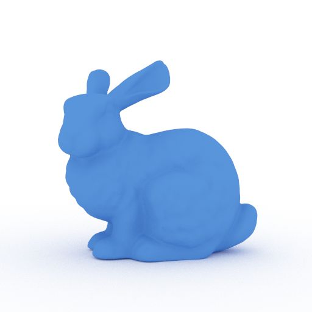

# Ray Tracer

This project is a ray tracer built as part of a Computer Graphics course. It implements standard ray tracing capabilities and several advanced features to enhance the realism and flexibility of rendered scenes.

## Final Render
 

## Features

### Alpha Masking
Alpha masking allows for transparency effects, giving materials a realistic translucent appearance. Ideal for rendering objects like glass, water, or other partially transparent materials.  
#### Before
  
#### After

### Area Lights
Supports area lights, allowing soft shadows and realistic lighting effects by simulating light sources with physical dimensions rather than point lights.  
#### Before
  
#### After

### Denoising
Integrated denoising capabilities to reduce noise in rendered images, particularly helpful for scenes with complex lighting and shadows.  
#### Before
  
#### After

### Shading Normals
Utilizes shading normals for improved surface appearance, enhancing the realism of materials under different lighting conditions.  
#### Before
  
#### After

### Thin Lens
Simulates depth of field effects with a thin lens model, providing realistic focus and blurring effects in scenes.  
  

### Volumes
Supports volumetric rendering for fog, smoke, and other participating media, enhancing scene atmosphere.  
#### Before
  
#### After

